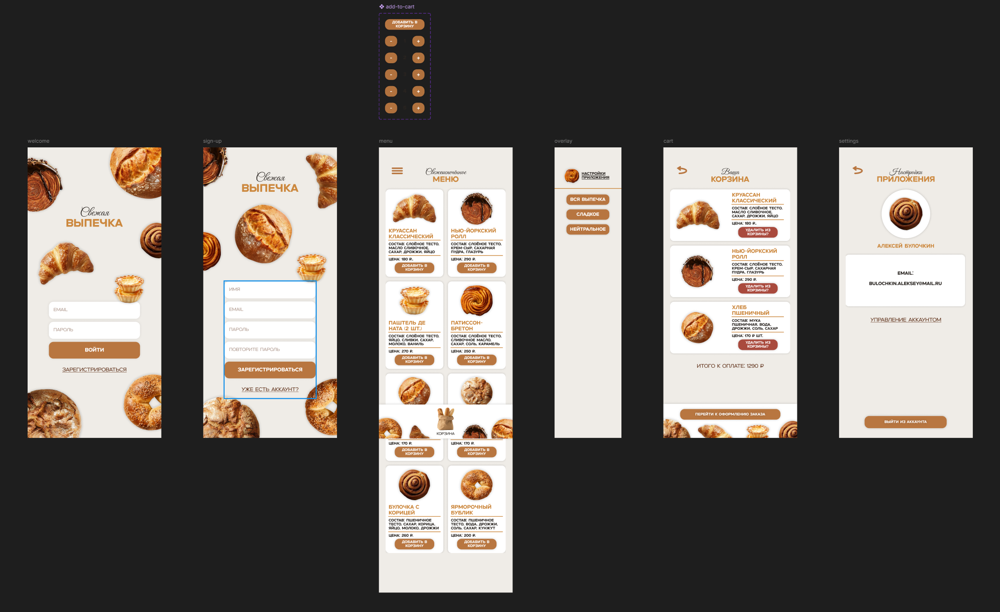
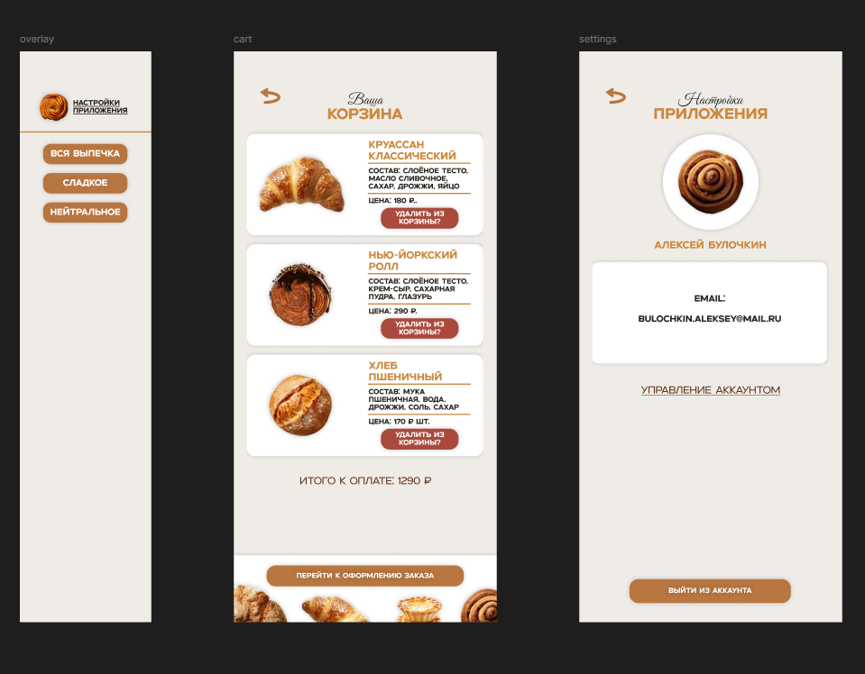

Программирование корпоративных систем. Сидоров Даниил ЭФБО-10-23.

Работа с макетами пользовательского интерфейса. Создание прототипа мобильного приложения.
Тема интерактивного прототипа: Пекарня

1.    Создание нового проекта и рабочего пространства:

В Figma был создан отдельный файл для дизайн макета. В нём были созданы все экраны под разрешение телефона: iPhone 16 Pro Max.

2.    Создание экрановв авторизации и регистрации:

Для создания дизайна было решеноиспользовать фотографии хлебобулочных изделий формата PNG и сделать акцент на бежевом и коричневом цветах.

3.    Создание экрана меню:

В экране меню находится выпечка двух доступных в приложении категорий: сладкое и нейтралоьное, а так де кнопка перехода в корзину кнопка открытия overlay меню. Также есть 8 активных карточек выпечки, нажав на кнопку добавить под которыми, можно "добавить" их в корзину.

Экраны корзины, настроек, а так же overlay меню.

4.    Связь всех экранов и окон:

После созданя всех экранов и окон были созданны переходы между ними.

Виды переходов, которые использовались:

   

5.    Демонстрация:

Вывод: Можно добавить предворительный просмотр позиций из меню, при нажатии на карточки, а так же добавить экран оформления заказа с адресом доставки, промокодом и способом оплаты заказа.