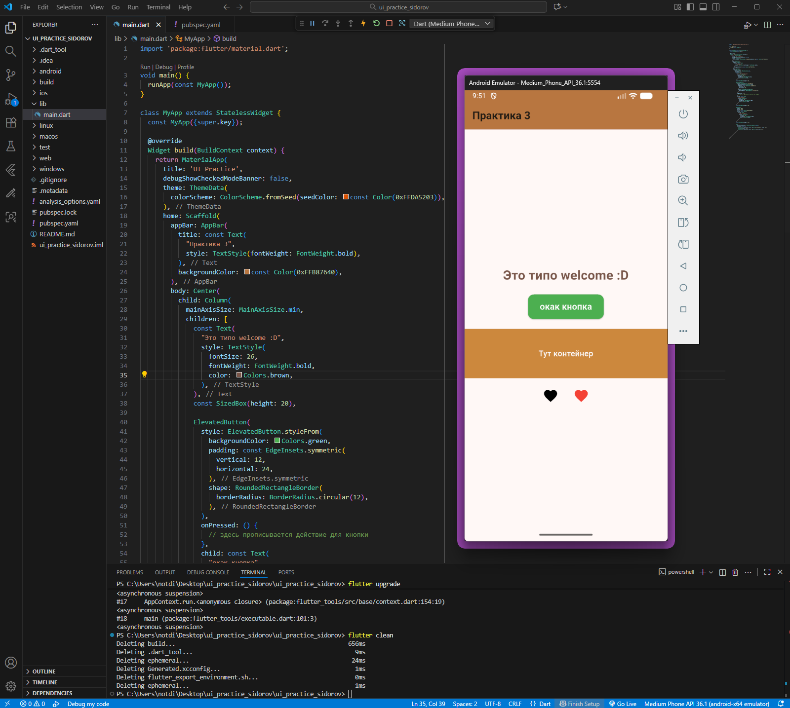
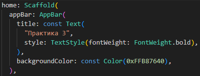
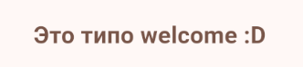
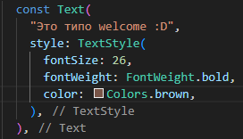
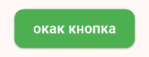
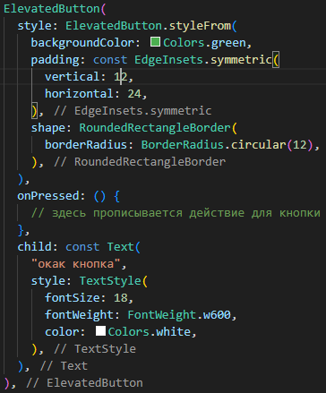
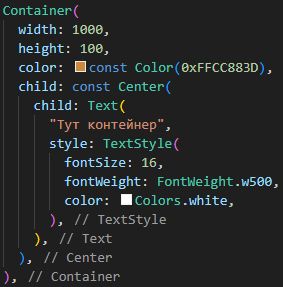
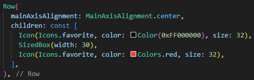

Программирование корпоративных систем. Сидоров Даниил ЭФБО-10-23.

Работа с компонентами пользовательского интерфейса. Работа с основными виджетами. Работа с цветами, шрифтами и компановкой элементов.

Скриншот с кодом и рабочим приложением:


### AppBar с заголовком "Практика 3" + отрывок кода:



### Collumn:

1.    Текст с приветствием (Text) + отрывок кода:




2.    Кнопка (ElevatedButton) + отрывок кода:




3.    Контейнер (Container) с заданным цветом и размерами + отрывок кода:




4.    Row внутри с двумя Icon + отрывок кода:




Отступы между элементами были реализованы через ``` SizedBox(width: <расстояние в пикселях>)```

В прикреплённом коде и на снимках экрана экрана видна работа как с основными необходимыми виджетами, так и с цветами, параметрами шрифтов,  и компановкой элементов.

Исходный код доступен по ссылке: https://github.com/idk-its-for-studies/mobile-development/%D0%9F%D1%80%D0%B0%D0%BA%D1%82%D0%B8%D1%87%D0%B5%D1%81%D0%BA%D0%BE%D0%B5%20%D0%B7%D0%B0%D0%BD%D1%8F%D1%82%D0%B8%D0%B5%20%E2%84%963/ui_practice_sidorov