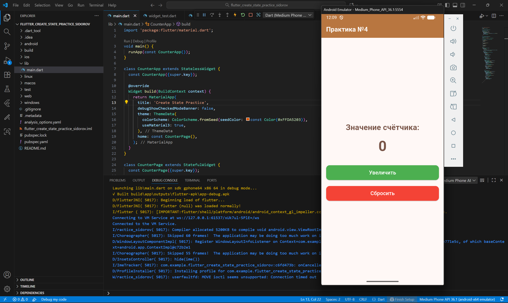
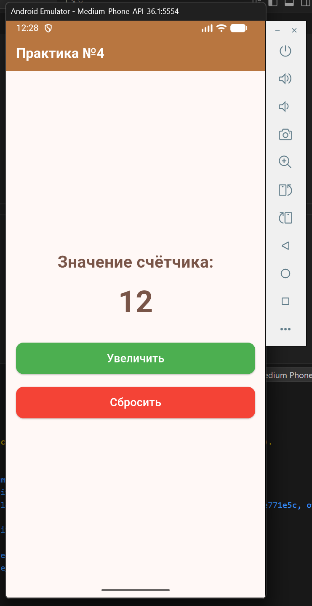
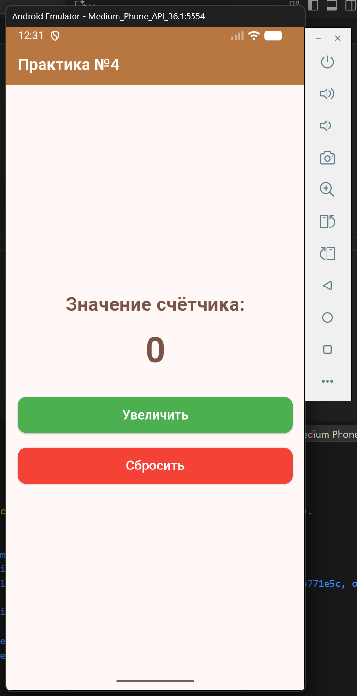
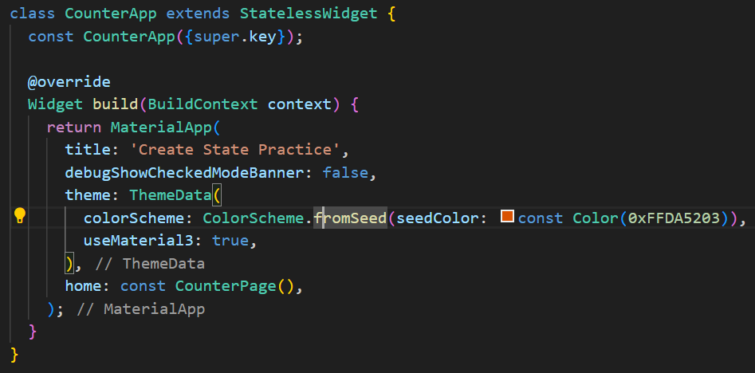
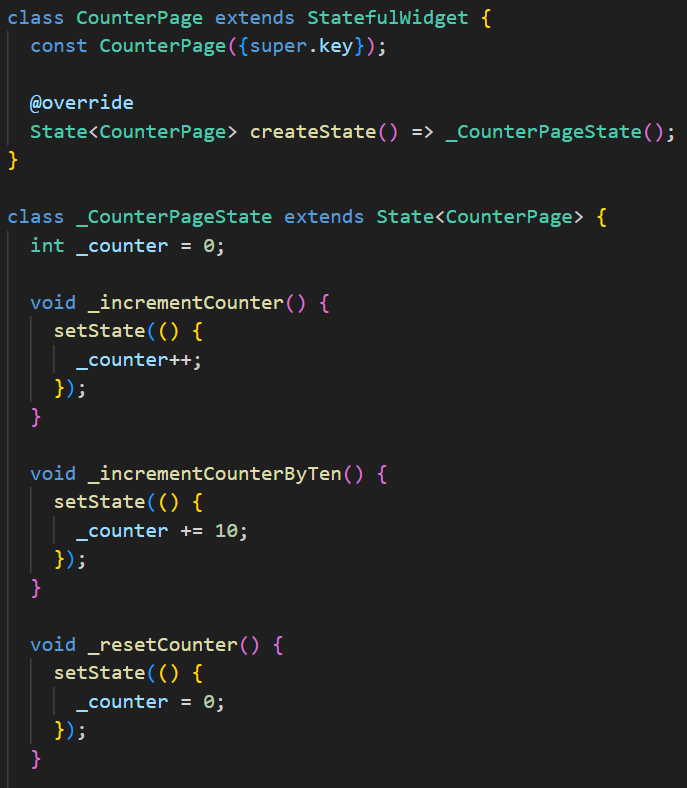
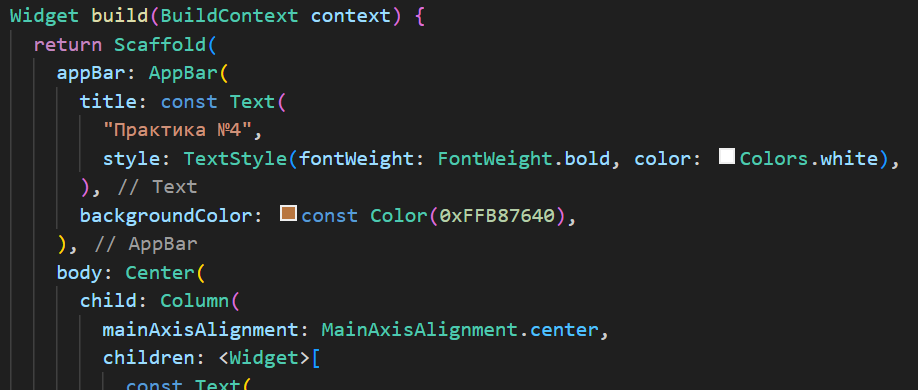
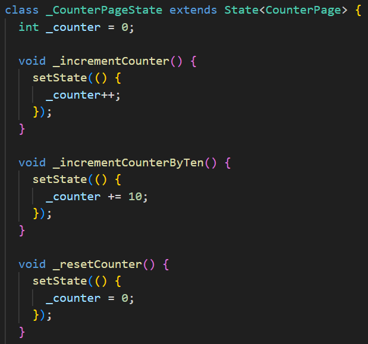
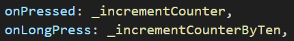

Программирование корпоративных систем. Сидоров Даниил ЭФБО-10-23.

Способы компоновки элементов и контейнеры. Обработка событий. Управление состоянием. Обновление состояния виджетов при нажатии кнопок или других событиях.

Скриншот с кодом и рабочим приложением:


Скриншот при значении счётчика > 10:


Скориншот после сброса:


#### Использовались виджеты:
Для класса CounterApp был использован StatelessWidget, так как в сам CounterApp не хранит состояние.


Для класса CounterPage был использован StatefulWidget, так как здесь нам необходимо хранить некое состояние, в нашем случае - значение счётчика.


В качестве базового каркаса экрана задействован Scaffold.


#### Обновление состояний:
Обновление состояний реализованно через ```setState()```. Ниже приведён отрывок кода, отвечающий за состояние счетчика.


#### Обрабатывались следующие события:
Краткое и долгое нажатия кнопки "Увеличить" (Pressed и LongPress соответственно):


Краткое нажаьтие увеличивает счетчик на 1 значение, долгое нажатие увеличивает счётчик сразу на 10 значений. Кнопка "Cбросить" cбрасывает значение счётчика до 0.