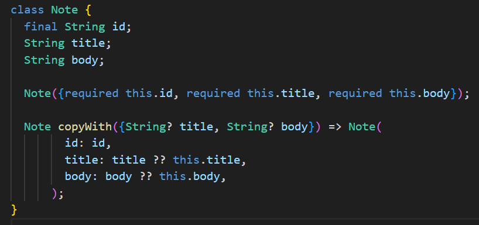
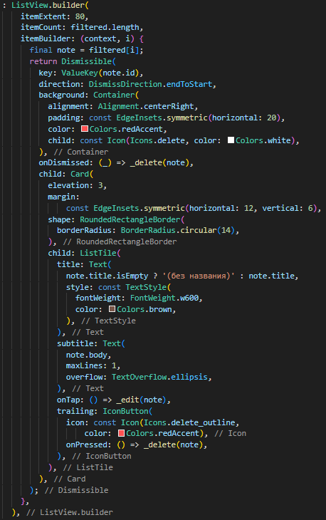
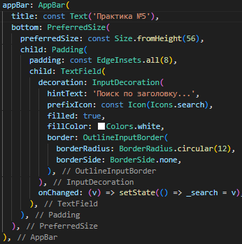
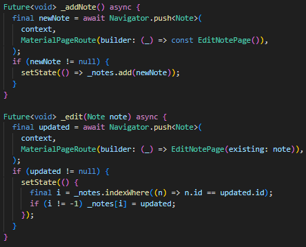
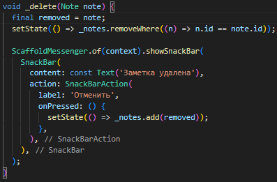
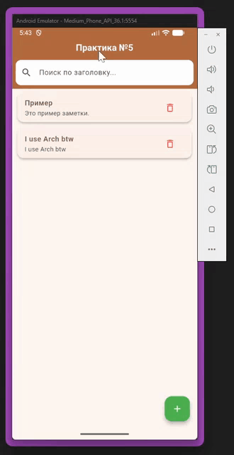

Программирование корпоративных систем. Сидоров Даниил ЭФБО-10-23.

Работа со списками. Передача данных между модулями.

Цели:
- Научиться отображать коллекции данных с помощью ListView.builder.
- Освоить базовую навигацию ```Navigator.push``` / ```Navigator.pop``` и передачу данных через конструктор.
- Научиться добавлять, редактировать и удалять элементы списка без внешних пакетов и сложных архитектур.

Ход работы:
- Создание проекта: ```flutter create simple_notes_sidorov```.
- Реализована модель Note в ```lib/models/note.dart``` с полями ```id```, ```title```, ```body``` и методом ```copyWith```.
- В main.dart создан главный экран с ```ListView.builder```, ```FloatingActionButton``` для добавления заметок, поиском в ```AppBar``` и удалением через ```Dismissible```.
- В ```edit_note_page.dart``` реализован экран добавления/редактирования с формой и сохранением через ```Navigator.pop```.

Модель Note:



ListView.builder с Dismissible:



Поиск в AppBar:



Добавление/редактирование заметки:



Удаление с Undo:



Демонстрация:



Выводы
Что получилось: 
- Реализовал приложение с динамическим списком заметок, добавлением, редактированием, удалением (через кнопку и свайп), поиском по заголовку.
- Что было сложным:
Настройка Dismissible для свайп-удаления и реализация поиска с переключением AppBar.

Исходный код доступен по ссылке: https://github.com/idk-its-for-studies/mobile-development/tree/c826f71e9be1a496b0d3b96e2b778e10f675bdd7/%D0%9F%D1%80%D0%B0%D0%BA%D1%82%D0%B8%D1%87%D0%B5%D1%81%D0%BA%D0%BE%D0%B5%20%D0%B7%D0%B0%D0%BD%D1%8F%D1%82%D0%B8%D0%B5%20%E2%84%965/simple_notes